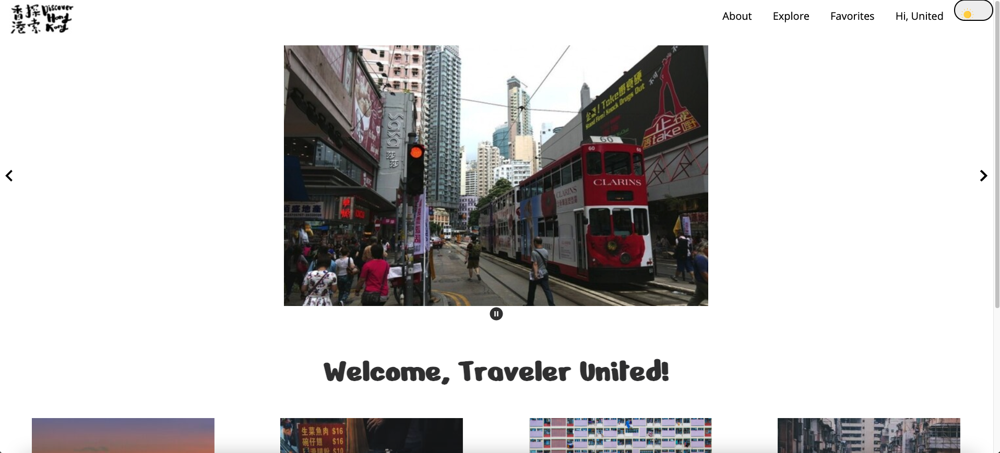
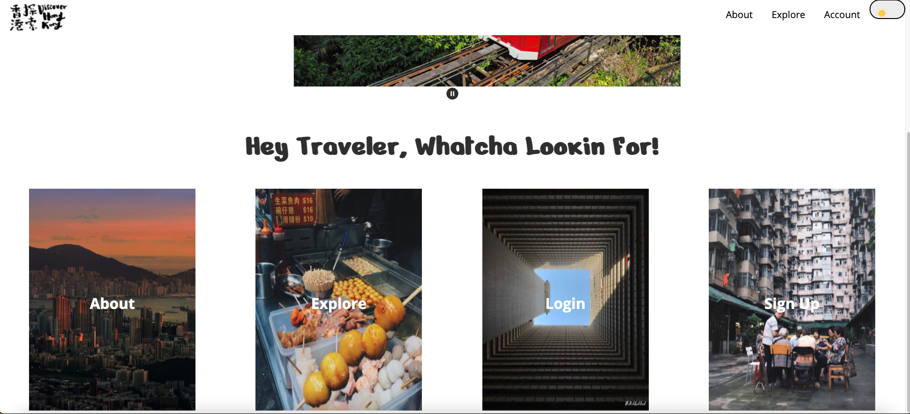
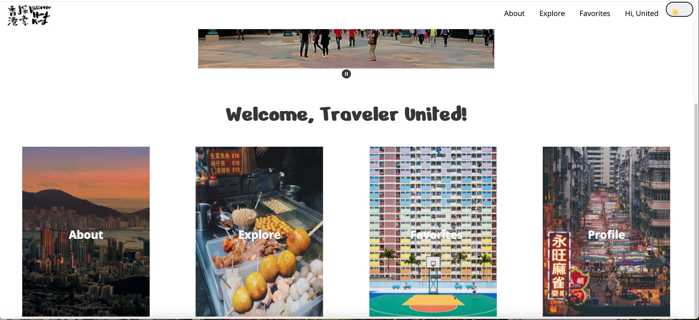
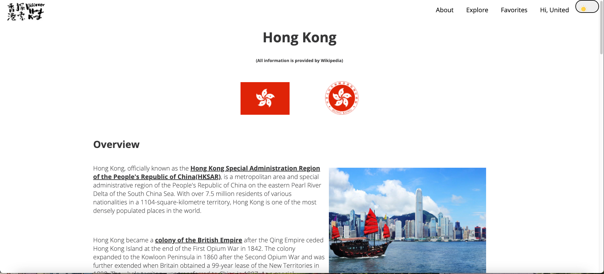
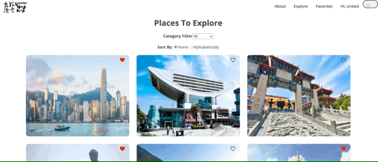
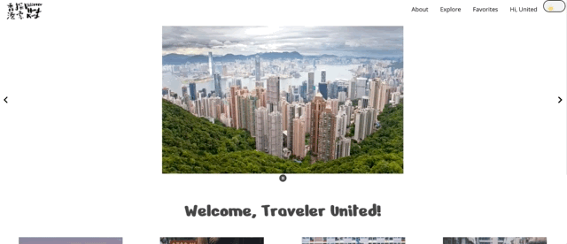

Sightseeing in Hong Kong 
====

## Objectives

This project is designed for users to enjoy a one-stop service to visit all the popular places in Hong Kong. Users can also customize their experience by creating an account and favorite places.

## Motivations

I wrote a >40page Google Doc for a friend who was visiting Hong Kong in summer 2018. As much as I like planning and recommending places for my friends, I wanted to make the documents into something more abstract and creative. Now that I have possessed web development skills, I decided to transform that Google Doc into a website. A user-friendly and simplistic looking website. 

## Techology Used

- Frontend: ReactJS 
    - Library used: react-slideshow-image (for slideshows on Home page)
    - Google Maps API
    - styled-components (light and dark theme)
- Backend: Ruby on Rails ([Backend Repository](https://github.com/mehmehmehlol/sightseeing-in-hk-backend/tree/433df084aa89531e0283dfb5bc2cbf65d4aa73f3))

## Installation

- Clone this repository
- Redirect to and clone backend repo 
- Run `rails s` to run the backend server in the terminal of backend folder (See Issues Currently Working On)
- Run `npm i` to install all dependencies
- Run `npm start` to start "localhost:3000"

## Screenshots

### Home

---

### Before Log In

---

### After Log In

---

### About

---

### Explore 

---

### Favorite

---

### Light and Dark Theme 

## Issues Currently Working On

- Unable to persist the change of theme colors when accessing a new page (Hook is required)
- Hit bugs when updating profile
- Encounter issues when deploying to Heroku

## Created By

[Megan Lo](https://github.com/mehmehmehlol)
